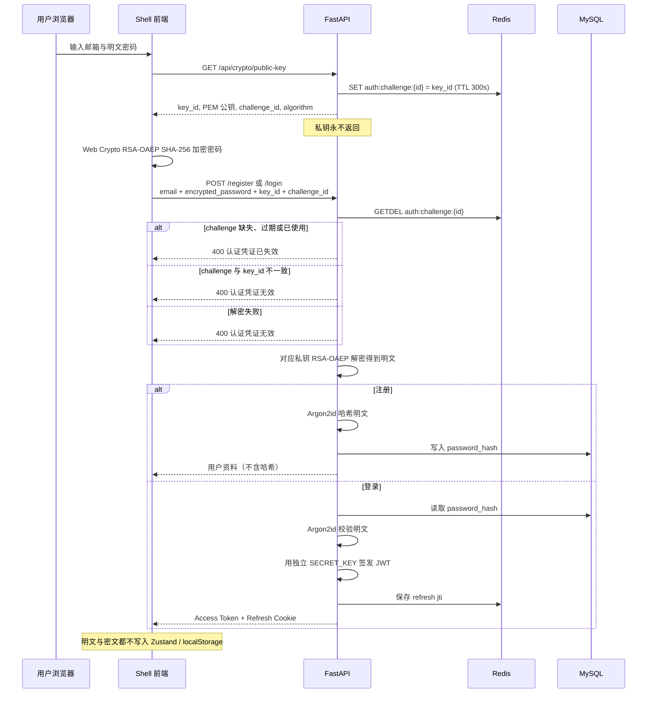

# 认证说明（V2.1.2）

本阶段只实现全局用户身份与 JWT，不实现租户和 RBAC。`users` 表没有 `tenant_id`，也没有角色字段。

## 完整认证流程



1. 注册/登录前请求 `GET /api/crypto/public-key`。这是公开接口，与 JWT 无关。
2. 服务端返回当前 RSA Public Key、`key_id`、一次性 `challenge_id`。
3. 前端用浏览器 Web Crypto 以 RSA-OAEP + SHA-256 加密用户输入的密码。
4. 请求体只传 `encrypted_password`（Base64），不传明文。
5. 服务端用对应 Private Key 解密。
6. 注册：对明文做 Argon2id 后入库。
7. 登录：对明文做 Argon2id 校验。
8. 校验通过后走现有 JWT 会话（Access Token + Refresh Cookie）。

## 公钥与私钥

| | Public Key | Private Key |
| --- | --- | --- |
| 谁持有 | 可以发给浏览器 | 只留在服务端 |
| 用途 | 加密密码 | 解密密码 |
| 泄露后果 | 攻击者可加密，但不能读已有密文 | 传输中的密码可被解密 |
| 格式 | PEM / SPKI | PEM / PKCS#8 |

RSA 公钥只用于加密密码；JWT Access / Refresh 用另一套 `SECRET_KEY` 做 HMAC 签名。二者不能混用。

## RSA 加密 vs Argon2id 哈希

二者解决的问题不同，必须叠在一起，不能互相替代。

- **RSA-OAEP**：可逆的传输保护。目标是让「从浏览器到 API」这一段看不到明文。服务端解密后立刻得到明文，再进入哈希步骤。
- **Argon2id**：不可逆的存储保护。目标是数据库泄露后也无法还原密码。即使运维能读 `password_hash`，也不能登录成该用户。

常见误解：

- 只做 RSA：数据库里若存明文或可逆密文，库一漏就全完。
- 只做 Argon2id：HTTPS 被降级、代理抓包或前端误打日志时，明文仍会暴露在传输路径上。
- 不要用 MD5 / SHA-256 当「加密」。它们是摘要，可被彩虹表或高速碰撞，既不能当传输加密，也不适合单独存密码。

## 为什么需要 HTTPS

RSA 只保护 **password 字段**，不能保护整次会话。

没有 TLS 时，攻击者仍可以：

- 看到邮箱、`key_id`、`challenge_id`、JWT Access Token。
- 调包公钥接口，换成自己的公钥（密钥替换），再解密用户密码。
- 重放或篡改其它 JSON 字段。

因此 RSA 是 **HTTPS 之上的纵深防御**，开发环境可用 HTTP，生产环境必须 HTTPS，Cookie 也要 `Secure`。

## 为什么需要 challenge_id

密文本身是确定填充下的随机输出，但 **同一段密文可以被重放**。攻击者截获一次登录请求后，在 challenge 失效前反复提交，就能反复尝试登录。

因此每次取公钥都会签发随机 `challenge_id`，写入 Redis：`auth:challenge:{id} → key_id`，默认 300 秒。认证时用 `GETDEL` **原子消费**。重复、过期、不存在一律拒绝。`challenge_id` 还必须与请求里的 `key_id` 一致。

不要只靠 RSA 防重放。

## 为什么 RSA 密钥不能和 JWT 密钥混用

| 密钥 | 配置 | 用途 |
| --- | --- | --- |
| RSA 私钥 | `RSA_PRIVATE_KEY_PATH` | 解开传输中的密码 |
| JWT `SECRET_KEY` | `SECRET_KEY` | HMAC 签发 Access / Refresh Token |

混用的问题：

- 用途不同：一个是加密，一个是签名。算法、生命周期、轮换节奏都不一样。
- 泄露面不同：JWT 密钥泄露会伪造登录态；RSA 私钥泄露会读传输中的密码。分开可以独立轮换、独立审计。
- 前端能看到 RSA 公钥，绝不能从中推导 JWT 密钥。

## 密钥管理

- 开发：`uv run python scripts/generate_rsa_keys.py --key-id v1`，私钥写到 `backend/secrets/rsa/v1/private.pem`（已 gitignore）。
- 生产：把 PEM 放到密钥管理系统或只读挂载文件，用 `RSA_PRIVATE_KEY_PATH` 指向它。不要把私钥写进镜像或仓库。
- 不要每次请求都生成新密钥对。当前密钥用 `RSA_KEY_ID` 标识。
- 轮换：先部署新密钥为 current，把旧私钥配到 `RSA_PREVIOUS_KEY_ID` / `RSA_PREVIOUS_PRIVATE_KEY_PATH`，窗口期内旧 `key_id` 仍可解密；确认无在途 challenge 后再下线旧钥。
- 私钥权限建议 `0600`。

## 数据模型

`users`

| 字段 | 说明 |
| --- | --- |
| id | 主键 |
| email | 唯一，存储前转小写 |
| password_hash | Argon2id 存储哈希，接口永不返回 |
| display_name | 显示名称 |
| status | `ACTIVE` / `DISABLED` |
| last_login_at | 最近登录 |
| created_at / updated_at | 时间戳 |

## 令牌设计

- Access Token：30 分钟，响应 JSON 返回，前端只放内存。
- Refresh Token：7 天，HttpOnly Cookie，`Path=/api/v1/auth`，开发环境 `SameSite=Lax`、`Secure=false`；生产环境强制 `Secure`。
- Payload：`sub`、`type`（access/refresh）、`iat`、`exp`、`jti`。
- Redis 键：`auth:refresh:{jti}`，值为 user_id。退出或刷新轮换时删除旧 jti。

Refresh Token 不能当作 Access Token 访问 `/me`。

## 认证白名单

公开接口写在 `app/core/auth_public.py`，按 **HTTP Method + 完整路径** 精确匹配。

| 方法 | 路径 | 校验什么 |
| --- | --- | --- |
| GET | /api/v1/health | 无 |
| GET | /api/crypto/public-key | 无（RSA 公钥，可选 `key_id`） |
| POST | /api/v1/auth/register | RSA challenge，无 JWT |
| POST | /api/v1/auth/login | RSA challenge，无 JWT |
| POST | /api/v1/auth/refresh | **只校验 Refresh Cookie** |
| POST | /api/v1/auth/logout | Refresh Cookie，可空 |

`GET /api/v1/auth/me` 必须带有效 Access Token。

### Access Token 与 Refresh Token 的生命周期

- Access Token：约 30 分钟，内存保存，过期后业务接口 401。
- Refresh Token：约 7 天，HttpOnly Cookie，`Path=/api/v1/auth`。每次 `/refresh` 成功会用 Redis `GETDEL` 原子消费旧 jti 再签发新 Cookie，并发刷新时只有一个请求能成功。

`/refresh` **不走** `get_current_user()`。没有 Cookie、过期、无效或已撤销时返回 **401**。这是正常认证结果，不要改成 200。前端不能用 `document.cookie` 判断 HttpOnly Cookie 是否存在。

开发请统一 `http://localhost:8011` / `http://localhost:8015`，不要混用 `127.0.0.1`，否则 Cookie 不会带上。前端直连 API，没有 Vite 代理；Cookie Domain 不设置（host-only），`SameSite=Lax`，开发环境 `Secure=false`。不同端口的 `localhost` 视为同站，Refresh Cookie 可以随跨端口 XHR 发送。

## Axios 自动刷新

Shell 有两个客户端：

- `authClient`：公钥、登录、注册、Refresh、Logout。不带 Access Token，也不触发自动刷新。
- `apiClient`：业务接口。401 时用 `authClient` 刷新一次（模块级单飞 Promise），成功后重放原请求，每条最多重试一次。

登录成功后 **不会** 立刻再打 Refresh。只有刷新页面且内存没有 Access Token 时，`AuthBootstrap` 才调用一次 Restore，并与业务 401 刷新共用同一个 Promise。Restore 收到 401 视为未登录，不弹窗。

ERP **不调用 Refresh**，只用 Shell 通过 Wujie props 传入的 token，避免双边轮换把 Redis 会话作废。独立启动 ERP 时没有 Shell token，业务接口可能 401，但不会去轮换 Cookie。

## 前端异常处理

- 使用 `ApiError`（`status` + 业务 `code` + `message`），不要把密码、Token、密文写进错误对象。
- 拦截器负责分类：业务 4xx 用后端文案；5xx 提示服务暂不可用；无响应提示网络异常；取消请求不弹窗。
- 页面里自行 `message.error`；拦截器不再弹一层，避免重复提示。
- 仓库内没有 `debugger` 语句。若 Chrome / Cursor 在 `Promise.reject` 处停下，是 DevTools 的 **Pause on exceptions / Pause on caught exceptions**，关掉该项即可。不要为了绕过断点而吞掉异常。

## API

| 方法 | 路径 | 说明 | 鉴权 |
| --- | --- | --- | --- |
| GET | /api/crypto/public-key | RSA 公钥与一次性 challenge，可选 `key_id` | 否 |
| POST | /api/v1/auth/register | 注册（RSA 密文） | 否 |
| POST | /api/v1/auth/login | 登录（RSA 密文） | 否 |
| POST | /api/v1/auth/refresh | 刷新 Access Token | Refresh Cookie |
| POST | /api/v1/auth/logout | 撤销 Refresh 并清 Cookie | Refresh Cookie（可空） |
| GET | /api/v1/auth/me | 当前用户 | Access Token |

公钥返回 `key_id`、`public_key`、`algorithm`、`challenge_id`、`expires_in`。未知 `key_id` 返回 404。私钥永不返回。

注册 / 登录提交 `email`、`encrypted_password`、`key_id`、`challenge_id`（注册另加 `display_name`）。

## 前端流程

Zustand `status`：`initializing` → `authenticated` | `unauthenticated`。初始化结束前不把「没有 Access Token」当成已判定未登录去跳转。

1. 启动：若内存无 Access Token，用 `authClient` 调一次 `/refresh`。
2. 200：写入 Access Token，进入 `authenticated`，再按需请求 `/me`。
3. 401：进入 `unauthenticated`，不弹窗。随后访客页可访问，受保护路由去登录。
4. 登录成功：直接保存 Access Token，**不再打 Refresh**。
5. 业务 401：`apiClient` 单飞 Refresh，成功重放，失败清状态并去登录。
6. ERP 只消费 Shell 传入的 token。

明文密码不得写入 Zustand、localStorage 或 sessionStorage。

## 环境变量

见 `backend/.env.example`。至少需要：

- `SECRET_KEY`（仅 JWT，不要复用为 RSA）
- `JWT_ACCESS_EXPIRE_MINUTES` / `JWT_REFRESH_EXPIRE_DAYS`
- `RSA_KEY_ID` / `RSA_PRIVATE_KEY_PATH` / `RSA_PUBLIC_KEY_PATH`
- `RSA_CHALLENGE_TTL_SECONDS`（默认 300）
- 轮换窗口：`RSA_PREVIOUS_KEY_ID` / `RSA_PREVIOUS_PRIVATE_KEY_PATH`
- `MYSQL_*`（库名使用 `neorvion_erp`，测试库 `neorvion_erp_test`）
- `REDIS_*`

不要把真实密钥写进文档或提交 `.env`。

升级说明：此前若以 SHA-256 摘要再哈希入库，RSA 方案改为对明文做 Argon2id，旧账号需要重新注册。

## 测试

```bash
cd backend
uv run pytest
```

测试会创建并使用独立数据库 `neorvion_erp_test`，以及 Redis DB 15。RSA 密钥在测试启动时写入临时目录，不使用开发私钥。
