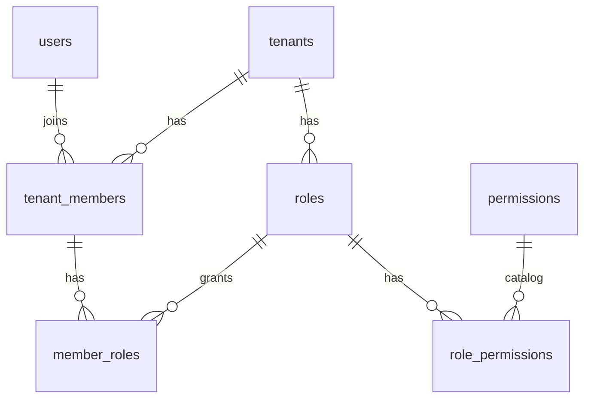
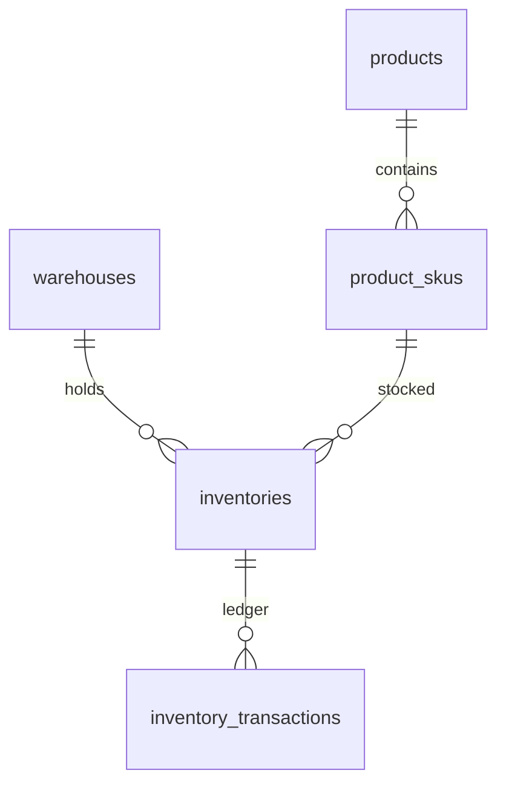
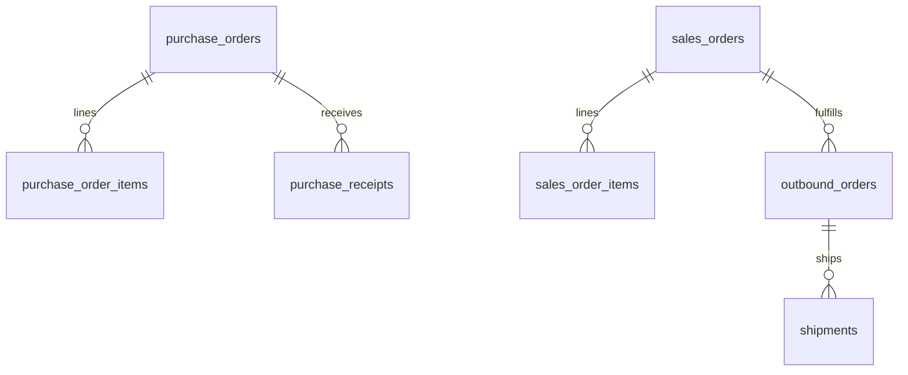
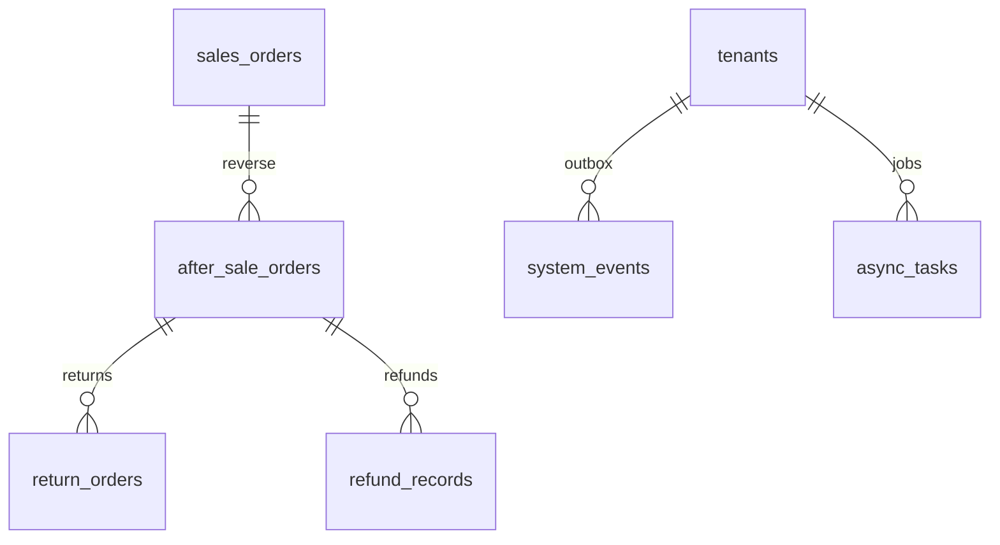

# 核心 ER（示意）

不是全库 45+ 张表。只帮助建立心智模型。

## 租户 / RBAC

```mermaid
erDiagram
  users ||--o{ tenant_members : joins
  tenants ||--o{ tenant_members : has
  tenants ||--o{ roles : has
  tenant_members ||--o{ member_roles : has
  roles ||--o{ member_roles : grants
  roles ||--o{ role_permissions : has
  permissions ||--o{ role_permissions : catalog
```

## 商品 / 库存

```mermaid
erDiagram
  products ||--o{ product_skus : contains
  warehouses ||--o{ inventories : holds
  product_skus ||--o{ inventories : stocked
  inventories ||--o{ inventory_transactions : ledger
```

## 采购 / 销售 / 履约

```mermaid
erDiagram
  purchase_orders ||--o{ purchase_order_items : lines
  purchase_orders ||--o{ purchase_receipts : receives
  sales_orders ||--o{ sales_order_items : lines
  sales_orders ||--o{ outbound_orders : fulfills
  outbound_orders ||--o{ shipments : ships
```

## 售后 / 事件

```mermaid
erDiagram
  sales_orders ||--o{ after_sale_orders : reverse
  after_sale_orders ||--o{ return_orders : returns
  after_sale_orders ||--o{ refund_records : refunds
  tenants ||--o{ system_events : outbox
  tenants ||--o{ async_tasks : jobs
```
